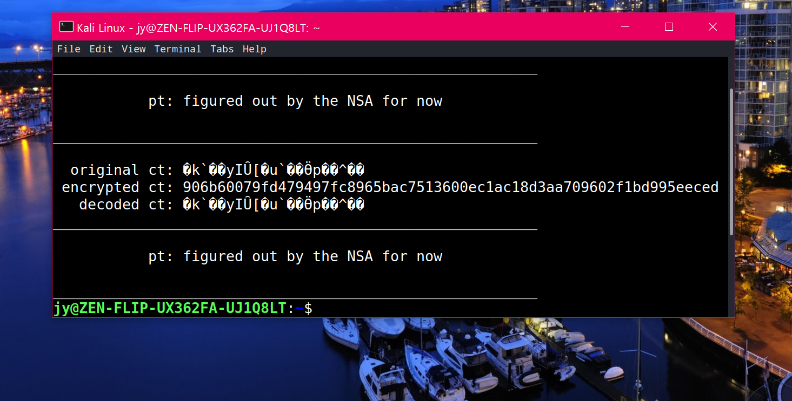

>*"RNG를 만들 때는 가장 단순한 알고리즘이 가장 강력하다.*  
>*복잡성이 커지면 너무 정밀해지고 패턴이 나와서 예측이 쉽다."*  
>>20.5.6 UNIST 박종화, **2020 봄 카오스강연 '첨단기술의 과학'**  
  

  
2020 Program42 Competition

team:     사이버작전사령부  
video:    https://youtu.be/12G7eWwGvJM  
email:    junelee@student.42seoul.kr  
intra ID: junelee  
project: 타원곡선암호 복호화

# 42_Decipher
동동동대문을 열어라♪ 평평평문을 열어라♬ 12시가 되면은 드듬칫드듬칫  
기지평문: known_plain_text  
암호전문: encrypted_text  
타원곡선: decipher.py  
  
Disclaimer  
==========
- **주의**
  - 1.전공자가 아니며   
  - 2.수업은 들었으나 잘하진 못했고(미분기하:A, 현대대수:B)  
  - 3.입대전에 수강하였기때문에 거의-제로베이스에 가깝습니다.  
- 따라서 일부내용에 틀린부분이 있을 수 있습니다.(없을수도..)🕵  
  
Concept_1_  
==========
  시작점 G를 d번 더하여 d*G를 구함.  
  >  
  
  이때, 몇 번 더하는지를 알려주는 d는 개인키가 됨.  
  즉, 위 예시에서 개인키는 4 공개키는 4G.  
  
Concept_2_  
==========
  아무리 큰 수가 들어와도 modulo 연산으로 유한체 내에 해가 있게 함.  
  유한체에서의 연산과 실수체에서의 연산이 다름에 주의.  
  >  
  
  >  
    
Concept_3_  
==========
  같은 평문이라도 전체 길이에 따라 암호문은 전혀 다른 값이 됨.  
  평문 figured out by NSA for now와 평문 by NSA for now에서  
  평문의 일부인 NSA가 변조된 결과는 다름.  
  따라서 ft_atoi_base.c와 같은 방법으로 풀 수 없음.  
  
Concept_4_  
==========
  아스키코드가 0 ~ 255인 점에 착안하여 256 base를 사용함.  
  >  
  
